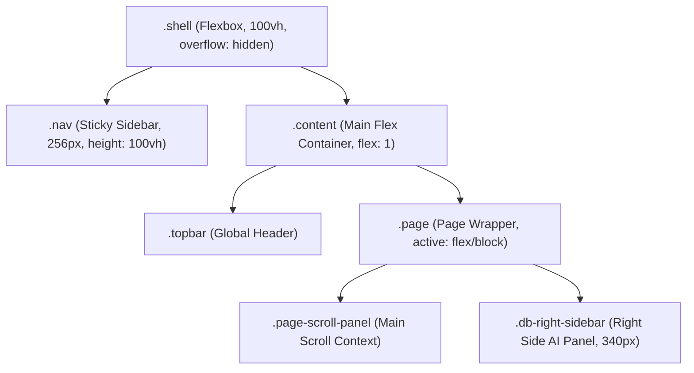

# Nexwear Admin: Global Layout System & Architecture Standard

This architectural blueprint outlines a standardized, production-grade layout system designed to ensure pixel-perfect consistency, robust component scaling, fluid responsiveness, and overlap-free dropdown/modal stacking across the entire Nexwear platform.

---

## 1. Core Layout Architecture Model

Modern SaaS layout engines should utilize a **Flexbox-wrapped Sticky Shell** with nested, scrolled panels to prevent page-level jumpiness and scrollbar duplication.



---

## 2. Standardized CSS Tokens & Variables

To guarantee consistency, all layout spacings, widths, and stacking hierarchies must draw from global CSS custom variables.

```css
:root {
    /* ─── LAYOUT WIDTHS ─── */
    --w-sidebar: 256px;
    --w-right-panel: 340px;
    --w-max-content: 1600px;
    
    /* ─── PADDING & SPACING (Fluid 4px Grid) ─── */
    --space-xs: 8px;
    --space-sm: 12px;
    --space-md: 16px;
    --space-lg: 24px;
    --space-xl: 32px;
    --space-xxl: 48px;
    
    /* ─── BRACKETS & BORDERS ─── */
    --radius-card: 16px;
    --radius-pill: 30px;
    
    /* ─── Z-INDEX SCALE (Standardized Stacking Context) ─── */
    --z-base: 1;
    --z-dropdown: 100;
    --z-sticky-nav: 200;
    --z-topbar: 300;
    --z-modal-backdrop: 1000;
    --z-modal-content: 1010;
    --z-toast: 9999;
}
```

---

## 3. Modals, Dropdowns & Overlaps Stacking Rules

### 🚨 Dropdown Overlap Prevention Strategy
1. **Stacking Context Creation**: Avoid defining `position: relative` with heavy `z-index` values on structural layout containers (like page cards or grids) as it forces local nested contexts that trap dropdowns under nearby blocks.
2. **Dynamic Viewport Placement**:
   - Renders custom dropdown lists using absolute positioning relative to their parents.
   - Set `.dropdown-menu { z-index: var(--z-dropdown); }`.
   - To prevent bounds clipping on scroll areas, use CSS `position: absolute; top: 100%; right: 0;` and force parents to support `overflow: visible;` during dropdown interactions.
3. **Escaping Overflow**: If a container *must* have `overflow: hidden`, use Javascript to attach dropdown markup directly to `document.body` (portal rendering) and position it dynamically utilizing `.getBoundingClientRect()`.

### 🛡️ Modals & Sticky Stacking Hierarchy
Modals must reside completely outside the layout grid and attach to the document root to prevent stacking inheritance bugs:
* **Overlay Backdrops**: Renders utilizing `position: fixed; top: 0; left: 0; width: 100vw; height: 100vh; z-index: var(--z-modal-backdrop); background: rgba(15, 23, 42, 0.4); backdrop-filter: blur(8px);`
* **Modal Body**: Centered within the parent backdrop container utilizing Flexbox (`display: flex; align-items: center; justify-content: center; z-index: var(--z-modal-content);`).

---

## 4. Bulletproof Layout Skeleton (HTML / CSS)

### Standard HTML Blueprint
```html
<div class="shell">
  
  <!-- 1. Left Sidebar Navigation -->
  <aside class="nav">
    <div class="nav-brand">...</div>
    <div class="nav-menu">
      <div class="nav-item nav-parent active">
        <span>Dashboard</span>
        <span class="nav-chevron open">›</span>
      </div>
      <div class="nav-submenu open">
        <div class="nav-sub-item active">Overview</div>
        <div class="nav-sub-item">Live Feed</div>
      </div>
    </div>
  </aside>

  <!-- 2. Main Content Wrapper -->
  <main class="content">
    
    <!-- Topbar Header -->
    <header class="topbar">
      <div class="topbar-left">...</div>
      <div class="topbar-right">...</div>
    </header>

    <!-- Active Page Content Area -->
    <div class="page active" id="page-dashboard">
      
      <!-- Left Panel Scroll Context -->
      <section class="page-scroll-panel">
        <div class="kpi-row col-4">...</div>
        <div class="card">...</div>
      </section>

      <!-- Right Panel Side Widget Area (e.g. AI Assistant) -->
      <aside class="db-right-sidebar">
        ...
      </aside>

    </div>
  </main>

  <!-- 3. Viewport-Anchored Modals -->
  <div class="modal-overlay" id="global-modal" style="display: none;">
    <div class="modal-container">
      ...
    </div>
  </div>

</div>
```

### Standard CSS Layout Grid Rules
```css
/* Shell Wrapper */
.shell {
    display: flex;
    width: 100vw;
    height: 100vh;
    overflow: hidden;
}

/* Sidebar */
.nav {
    width: var(--w-sidebar);
    min-width: var(--w-sidebar);
    height: 100vh;
    position: sticky;
    top: 0;
    overflow-y: auto;
    background: #ffffff;
    border-right: 1px solid var(--border);
    z-index: var(--z-sticky-nav);
}

/* Main Content Wrapper */
.content {
    flex: 1;
    height: 100vh;
    display: flex;
    flex-direction: column;
    overflow: hidden; /* Main wrapper is non-scrolling! */
}

/* Header */
.topbar {
    height: 72px;
    padding: var(--space-md) var(--space-xl);
    display: flex;
    justify-content: space-between;
    align-items: center;
    border-bottom: 1px solid var(--border);
    background: #ffffff;
    z-index: var(--z-topbar);
}

/* Page Frame */
.page {
    flex: 1;
    display: none;
    overflow: hidden; /* Page holds internal scrolling panels! */
}

.page.active {
    display: flex; /* Flex rows split the layout: content vs right panel */
}

/* Inner Left Scrolled Panel */
.page-scroll-panel {
    flex: 1;
    overflow-y: auto;
    padding: var(--space-lg) var(--space-xl);
    display: flex;
    flex-direction: column;
    gap: var(--space-lg);
}

/* Inner Right Side Panel (AI widget) */
.db-right-sidebar {
    width: var(--w-right-panel);
    min-width: var(--w-right-panel);
    height: 100%;
    overflow-y: auto;
    background: #ffffff;
    border-left: 1px solid var(--border);
    padding: var(--space-lg) var(--space-md);
    display: flex;
    flex-direction: column;
    gap: var(--space-md);
}

/* Responsive Adaptive Viewports */
@media (max-width: 1200px) {
    .page.active {
        flex-direction: column; /* Stacks scroll area & right panel vertically */
    }
    .page-scroll-panel {
        overflow: visible;
        height: auto;
    }
    .db-right-sidebar {
        width: 100%;
        min-width: 100%;
        border-left: none;
        border-top: 1px solid var(--border);
        overflow: visible;
        height: auto;
    }
}
```

---

## 5. Responsive Grid Breakpoint Specifications

Establish standardized breakpoints across the system to maintain uniform layout wrapping:

| Breakpoint | Target Devices | Behavior & Spacing Rules |
| :--- | :--- | :--- |
| **`> 1440px`** (Wide Desktop) | 1080p+ Screens | Maximize content padding (`36px`). Right AI Panel is locked side-by-side (`340px`). KPI Cards grid takes `repeat(4, 1fr)`. |
| **`1024px - 1440px`** (Standard Laptop) | Laptops | Fluid content padding (`24px 32px`). Right Sidebar scaled to `340px`. KPI Cards scaled gracefully utilizing compact padding. |
| **`768px - 1024px`** (Tablet Landscape) | iPads / Small Screens | Collapse sidebar navigation into icon-only mode or hide using mobile off-canvas drawer. Stacks content grids vertically. |
| **`< 768px`** (Mobile Devices) | Smartphones | Sidenav hidden. Display a floating hamburger toggle in Topbar. KPI Cards rearrange into `repeat(2, 1fr)` or full-width blocks. |
